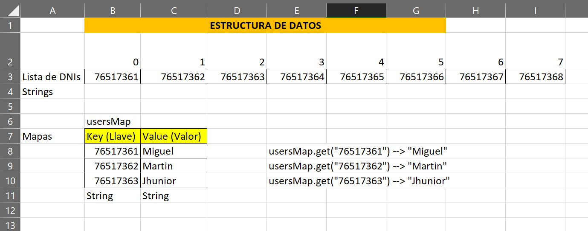

# ESTRUCTURAS DE DATOS

17 y 18 de agosto de 2024  

[← Regresar a notas](../../README.md)  

---

## Itinerario 📋
- Revisión de reto técnico
- Mapas y listas
  

- Recorrer (for), agregar, obtener elementos de una lista
- Agregar y obtener elementos de un mapa
- Revisión de ejercicios

---

## Vocabulario 🔍
- Índice de una lista o mapa
- for each