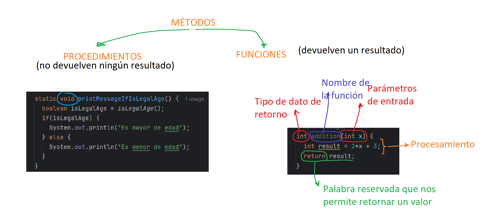

# MÉTODOS (FUNCIONES Y PROCEDIMIENTOS)

24 y 25 de agosto de 2024  

[← Regresar a notas](../../README.md)  

---

## Itinerario 📋
- Revisión de ejercicios (mapas y listas)
- Revisión de conceptos (compilación, variables, asignación, declaración, tipos de datos, etc)
- Función (retorna un valor `return`)
- Procedimiento (no retorna ningún valor `void`)
- Expresiones regulares ([REGEX](https://github.com/miguel-armas-abt/technical-resources/blob/main/05_cross/regex/REGEX.md))

---

## Vocabulario 🔍
- Métodos
- Funciones
- Procedimientos
- Parámetros
- Expresión regular